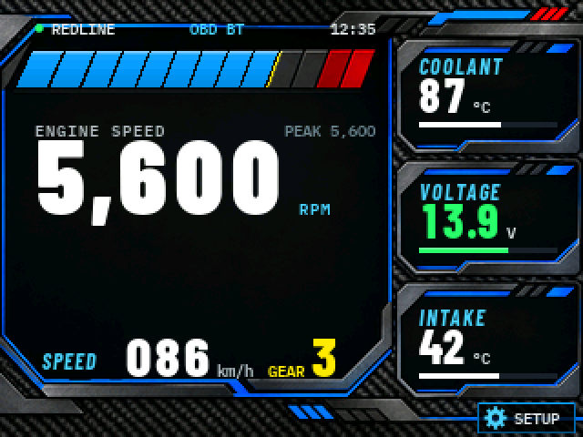
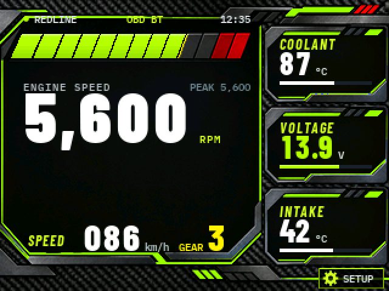
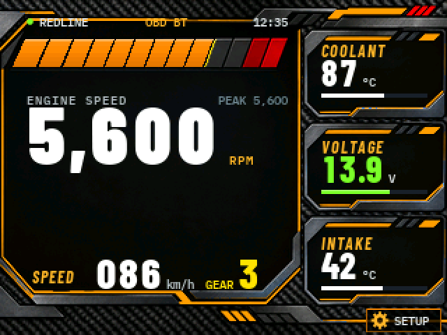
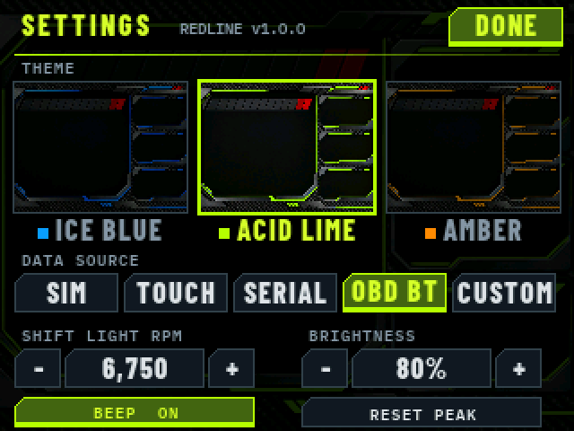
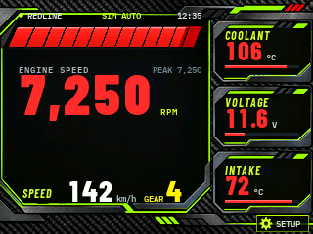
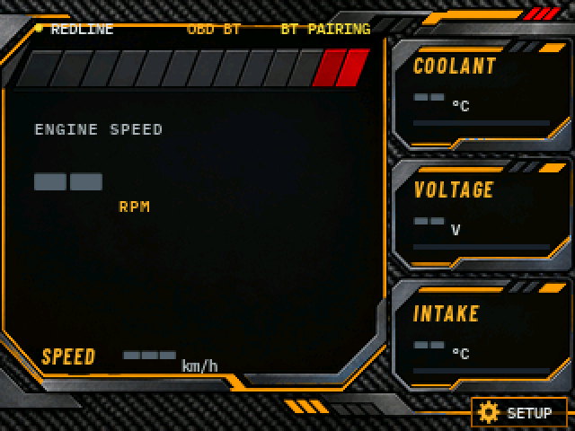

# REDLINE

**A motorsport-style digital dash for the $10 "Cheap Yellow Display" (ESP32-2432S028R).**
RPM shift bar, speed, gear, coolant / voltage / intake panels, shift light, warnings —
three colour themes, a touch settings page, a physics simulator, and real data from
OBD-II Bluetooth, USB serial, or your own sensors.

[](https://github.com/moomdate/redline-gauge/actions/workflows/ci.yml)


> 🇹🇭 คู่มือภาษาไทย (how each mode works, motorcycles/Honda Wave, wiring): **[README.th.md](README.th.md)**

**Features**
- Flicker-free partial redraw at ~30 fps, anti-aliased fonts blended onto the artwork
- 3 themes (ICE BLUE, ACID LIME, AMBER), switchable on the device
- Shift light (bar flash, RGB LED, beep), warn/critical colours, stale-data `--`, peak hold, gear estimate
- Data sources: SIM, TOUCH (you're the throttle), SERIAL, OBD BT (ELM327), CUSTOM (your sensors)
- Settings saved in NVS · host-side unit tests · CI builds both panel variants

| ICE BLUE | ACID LIME | AMBER |
|---|---|---|
|  |  |  |

| Settings | Shift light + warnings | Waiting for link |
|---|---|---|
|  |  |  |

`docs/sim.gif` is a real render from the firmware code (SIM AUTO mode), produced by the host preview.

## Build & flash

```bash
ls /dev/cu.*                                                   # find the port (the number changes between plugs)
~/.platformio/penv/bin/pio run -e esp32dev -t upload --upload-port /dev/cu.usbserial-XXXX
~/.platformio/penv/bin/pio device monitor                       # 115200
```
- `esp32dev` = a panel that needs color inversion (the original board)
- `cyd-noinvert` = a panel with normal colors (if colors look inverted, switch env)

## Using it

| Action | Result |
|---|---|
| **Tap SETUP** (bottom-right) or the status bar | Open the settings page |
| **Hold the main area** in SIM TOUCH | Throttle: further right = more throttle, release to coast |
| **Long-press the main area** (other modes) | Reset PEAK RPM |

### Settings page
- **THEME**: ICE BLUE / ACID LIME / AMBER (tap a thumbnail to change the theme immediately)
- **DATA SOURCE**: SIM · TOUCH · SERIAL · OBD BT · CUSTOM
- **SHIFT LIGHT RPM**: ± 250 (3,000 – `RPM_MAX`)
- **BRIGHTNESS**: 20–100% (backlight PWM)
- **BEEP ON/OFF**, **RESET PEAK**, **DONE** to go back

Every value is saved in NVS and restored after a reboot.

Serial commands (115200): `mode=sim|touch|serial|obd|custom` `theme=ice|lime|amber` `shift=6500`
`bright=80` `beep=on|off` `peak=reset` `help`

### Status bar
Dot color: 🟢 live data · 🔵 simulator · 🟡 (blinking) connecting · 🔴 error.
The right side shows the session time, or a status message such as `BT PAIRING`, `ELM INIT`, `ECU SEARCH`, `NO ADAPTER`, `NO ECU`, `WAIT DATA`.

### Warnings
- RPM ≥ `RPM_SHIFT` → the bar flashes red, the RPM number turns red, the RGB LED strobes red, and there is a short beep.
- Coolant / Voltage / Intake past their thresholds → value turns yellow (warn) or blinks red (critical), the LED blinks amber, and there is one beep.
- Coolant below `COOLANT_COLD` → shown blue (engine not warm yet).
- Any value not updated for 2.5 s → shows `--` (data never freezes on screen).

## Data sources

### 1. SIM AUTO / SIM TOUCH (simulator)
A physics-based car model: torque curve, 6-speed gearbox with auto-shift/kick-down, clutch launch, drag, braking,
coolant/intake heat model, and alternator voltage. It even cranks on start-up (voltage dips to ~10.6 V).
SIM AUTO loops a scripted drive: idle → city → full-throttle pull through the shift light → braking → highway.

### 2. OBD BT — ELM327 Bluetooth Classic (real car)
1. Plug the ELM327 into the car's OBD port and turn the ignition to ON / start the engine.
2. Set `OBD_BT_NAME` / `OBD_BT_PIN` in `src/config.h` to match your adapter (usually `OBDII` / `1234`).
   If you know the MAC, set `OBD_BT_MAC` — connecting is much faster (skips ~10 s of discovery).
3. Select OBD BT mode. It goes BT PAIRING → ELM INIT → ECU SEARCH → green dot.

Reads: RPM (010C), speed (010D), coolant (0105), intake (010F), battery voltage (ATRV).
RPM is polled every other request so the bar stays responsive. PIDs the car doesn't support are skipped automatically.
Gear is estimated from rpm/speed → set `GEAR_RATIOS`, `FINAL_DRIVE`, `TIRE_CIRCUMFERENCE_M` for your car
(or `GEAR_COUNT 0` to hide it).
> BLE-only adapters (e.g. Vgate iCar Pro BLE) don't work with this path — you need a Bluetooth Classic (SPP) one.

### 3. SERIAL — send values from another device
One line per update, any subset of values:
```
rpm=3200 spd=86 clt=87 volt=13.9 iat=42 gear=3
{"rpm":3200,"speed":86,"coolant":87,"voltage":13.9,"iat":42}
```
Test from a Mac: `~/.platformio/penv/bin/python tools/serial_feed.py /dev/cu.usbserial-XXXX`
(it sends `mode=serial` and a sweep of values automatically).

### 4. CUSTOM — your own values (sensors wired straight to the ESP32, CAN, etc.) ← easiest
Edit only **`src/my_sensors.cpp`**, then select SETUP → DATA SOURCE → CUSTOM:
```cpp
void mySensorsRead(GaugeInput &in) {
    in.voltage = readDividerVolts(35, 47000, 10000);   // 47k/10k divider from +12V
    in.coolant = readNtcCelsius(35, 2200, 2500, 3950); // NTC sender
    in.rpm     = tach.value();                         // PulseInput on the ignition signal
}
```
- Set only the fields you have. Anything left as `NAN` shows `--`.
- Ready-made helpers in `src/gauge_input.h`: `readDividerVolts`, `readNtcCelsius`, `PulseInput` (RPM/VSS from pulses).
- Try it without wiring: set `EXAMPLE_FAKE_VALUES 1` in `my_sensors.cpp`.
- Values coming from elsewhere (a CAN callback, a BLE notify): call `gauge::set(CH_RPM, v)` from any task. It is thread-safe.
- Free CYD pins: GPIO 35 (P3, analog/input only), GPIO 22, 27 (CN1). Car signals are 12–14 V: always use a divider or opto-isolator.

For a completely new source type, subclass `DataSource` (`src/data/source.h`) and add it to `sources[]` in `main.cpp`.

## Motorcycles (e.g. Honda Wave)
OBD BT does **not** work on Honda bikes: their 4-pin DLC speaks Honda's own K-Line protocol, not car OBD-II.
Use **CUSTOM** instead: ignition pulse → opto → GPIO 22 (`PulseInput`, usually 1 pulse/rev on a single),
battery divider on GPIO 35, oil-temp NTC on `in.coolant` with `PANEL1_LABEL "OIL TEMP"`, and
`RPM_MAX 10000`, `GEAR_COUNT 0` in `config.h`. Details in README.th.md §4.

## Tests

```bash
~/.platformio/penv/bin/pio test -e native    # 18 host tests: parsers, model, renderer, settings, simulator, theme assets
```
CI (GitHub Actions) runs the tests and builds both firmware variants on every push.

## Design sources
- `tools/art/bg_*.png`: the original 320×240 artwork of the 3 themes. `gen_bg.py` turns them into `src/assets/bg_*.h`

## Structure

```
src/
  main.cpp              setup/loop, data task (core 0), touch, LED + buzzer
  config.h              ← everything you tune: RPM_MAX, RPM_SHIFT, thresholds, gear ratios, OBD
  my_sensors.cpp        ← your own sensor code (CUSTOM source)
  gauge_input.h         GaugeInput + helpers (divider, NTC, pulse)
  settings.h            Settings struct (saved in NVS)
  data/gauge_bus.*      thread-safe store of the latest values (every source writes here)
  data/sim_source.*     simulator
  data/obd_source.*     ELM327 Bluetooth state machine
  data/serial_source.*  serial parser
  ui/gauge_model.*      raw values → what to show (smoothing, peak, warning levels, gear, status)
  ui/gauge_ui.*         layout + partial redraw per region + SETUP button
  ui/settings_ui.*      settings page
  ui/theme.*            theme table (background + accent colors)
  ui/canvas.*           RGB565 renderer + AA text blended onto the background image
  ui/shift_slots.h      13-slot shift-bar geometry pulled from the background (generated)
  fonts/*.h             Barlow Condensed / IBM Plex Mono (generated)
  assets/bg_*.h         3 theme backgrounds, 320×240 RGB565 (in flash, 150 KB each)
tools/
  host_preview/run.sh   build the real UI + simulator on the Mac → PNG/GIF (no board needed)
  gen_font.py, make_fonts.sh, gen_slots.py, gen_bg.py (--vivid), serial_feed.py
```

### Rendering design
- The background (150 KB) stays in flash. The screen is split into 7 regions (status, shift bar, RPM, speed, 3 panels).
  A region is redrawn only when its content changes: compose background + text into a 28 KB buffer, then push once → no flicker.
  On average only ~8% of the screen is pushed per frame (measured in the host preview).
- Fonts are anti-aliased and blended against the *actual background pixels*
  (TFT_eSPI smooth fonts blend against a single color, which leaves edge halos on an image background).
- Shift-bar segments sit exactly on the 13 slots painted in the art, with partial fill at the leading edge
  plus a peak-hold marker that falls back.

### Checking the UI without a board
```bash
PY=/path/to/python-with-pillow tools/host_preview/run.sh      # → tools/host_preview/out/*.png, sim.gif
```

### Regenerating fonts / changing the background
```bash
PY=/path/to/python-with-pillow tools/make_fonts.sh
python3 tools/gen_bg.py <png> bg_name src/assets/bg_name.h   # add a theme → add a row in src/ui/theme.cpp
```
Fonts: Barlow Condensed and IBM Plex Mono — SIL Open Font License (`tools/font_src/OFL.txt`).

## License

**PolyForm Noncommercial 1.0.0**: see [LICENSE.md](LICENSE.md) and [NOTICE](NOTICE).
You may use, modify and share REDLINE for free for any **noncommercial** purpose
(personal projects, your own car, learning, research, hobby clubs).
**Selling it or using it in a commercial product or service is not allowed.**
For commercial licensing, open an issue to get in touch.

> This is a *source-available* license, not an OSI "open source" license, because it restricts commercial use.

The fonts (Barlow Condensed, IBM Plex Mono) are © their authors under the SIL Open Font License 1.1.
